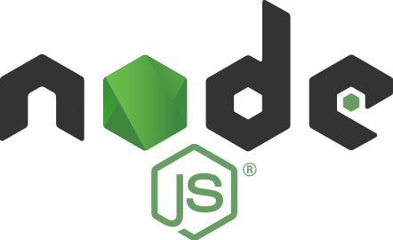

<h1 align="center" id="top">
    <picture>
        <source media="(prefers-color-scheme: dark)" srcset="./assets/node-logo-light.svg">
        
    </picture>    
     
    <strong>Node.js Collection</strong>
</h1>

TypeScript-first libraries and runtimes for high-performance Node.js applications. Zero-dependency where possible, built for production.

  

## Runtimes

<table align="center">
    <thead>
        <tr>
            <th width="180px">Runtime</th>
            <th>Description</th>
            <th>Stats</th>
        </tr>
    </thead>
    <tbody>
        <tr>
            <td>
                <a href="https://github.com/jamesgober/http-runtime-node.js">
                    <b>HTTP Runtime</b>
                </a>            </td>
            <td>
                <code>http-runtime-node.js</code>: 
                Zero-dependency <b>HTTP runtime</b> with 45k+ requests per second, strict security defaults, and circuit breakers.
            </td>
            <td align="center">
                
                 
                
            </td>
        </tr>
    </tbody>
</table>

  

## Author

James Gober
- [github.com/jamesgober](https://github.com/jamesgober)
- [npmjs.com/~jamesgober](https://www.npmjs.com/~jamesgober)

